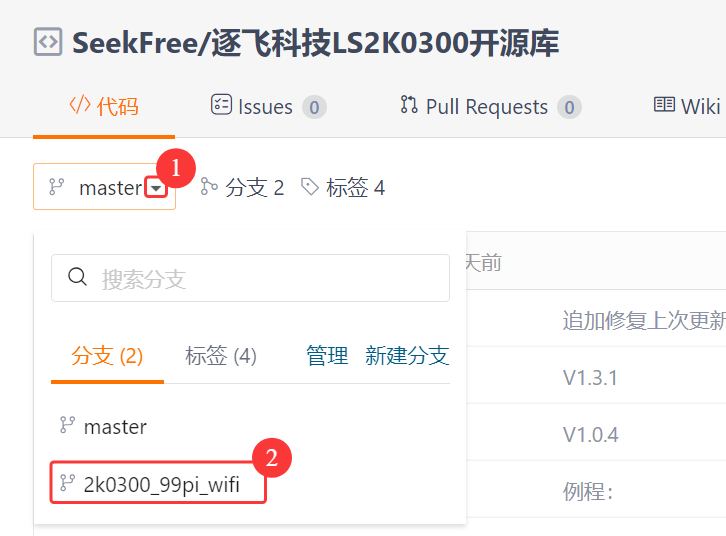
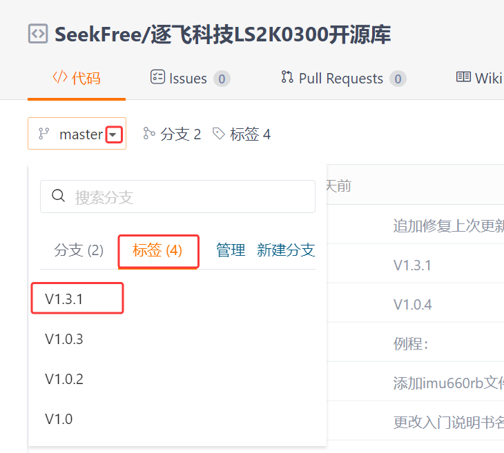

# 逐飞科技LS2K0300开源库

## 介绍
逐飞科技针对参加各类竞赛以及使用逐飞科技LS2K0300核心板进行产品开发，制作的逐飞科技LS2K0300高性能开源库。

目前，该库有两个分支，master分支为LS2K0300核心板，2k0300_99pi_wifi分支为久久派。

**如果，使用久久派的同学，请自行切换分支2k0300_99pi_wifi或者切换为1.0标签，进行下载。**

**如果，使用久久派的同学，请自行切换分支2k0300_99pi_wifi或者切换为1.0标签，进行下载。**

**如果，使用久久派的同学，请自行切换分支2k0300_99pi_wifi或者切换为1.0标签，进行下载。**






# 1、环境准备

## 1.1、**硬件环境：** 

- 推荐使用本公司逐飞科技LS2K0300核心板， [点击此处购买](https://item.taobao.com/item.htm?id=1004238154955)
- 

## 1.2、**软件开发环境：** 

- UBUNTU24.04
- 交叉编译器：loongson-gnu-toolchain-8.3-x86_64-loongarch64-linux-gnu-rc1.6.tar
- OpenCV：4.10

# 2、使用说明

## 2.1、**下载开源库：** 

推荐使用：

```
git clone https://gitee.com/seekfree/LS2K0300_Library.git 
```

进行克隆，到UBUNTU24.04里面。

**目前master分支为逐飞科技LS2K0300核心板，如果是使用久久派的同学，请自行切换分支到2k0300_99pi_wifi。**

**一定不要下载ZIP压缩包，这个一定会导致文件权限出现问题。**

## 2.2、使用开源库

1.  **打开工程：** 将下载好的工程文件夹打开。在打开工程前，请务必确保您的编译环境满足环境要求。如果没有安装编译环境，需要查看下面的文档资料进行安装。
2.  **文档：**/LS2K0300_Library/【文档】说明书 芯片手册等，这个文件夹中的文档包含编译环境的安装，交叉编译工具链的使用等。
