# 一、前言

该文档只适用于逐飞科技LS2K0300核心板，不适用久久派！！！

该文档只适用于逐飞科技LS2K0300核心板，不适用久久派！！！

该文档只适用于逐飞科技LS2K0300核心板，不适用久久派！！！

# 二、龙芯环境搭建软件包

通过网盘分享的文件：龙芯环境搭建软件
链接: https://pan.baidu.com/s/1GUz4VZZBqmnnQcF4jpTl2Q?pwd=cu9e 提取码: cu9e


# 三、UBUNTU安装

省略一万个字...

# 四、Ubuntu24.04更换清华源

## ‌1、备份原有的源配置文件‌：

　　打开终端，输入以下命令来备份原有的源配置文件，也可以直接不备份。

```
sudo cp /etc/apt/sources.list.d/ubuntu.sources  /etc/apt/sources.list.d/ubuntu.sources.bak
```

## 2、编辑源配置文件‌：

　　使用vi或其他文本编辑器打开源配置文件：

```
sudo vi /etc/apt/sources.list.d/ubuntu.sources
```

## 3、添加清华源的配置‌：　　

　　在打开的文件中，删除原有的内容，并粘贴以下清华源的配置：

```
Types: deb
URIs: https://mirrors.tuna.tsinghua.edu.cn/ubuntu/
Suites: noble noble-updates noble-security
Components: main restricted universe multiverse
Signed-By: /usr/share/keyrings/ubuntu-archive-keyring.gpg
```

## 4、更新源‌：　　

　　更新源配置并升级系统：

```
sudo apt-get update
sudo apt-get upgrade
```

通过以上步骤，你可以成功将Ubuntu 24.04的源更换为清华源。

## 5、安装必要的包

```
sudo apt-get install open-vm-tools -y
sudo apt-get install open-vm-tools-desktop -y
sudo apt-get install git -y
sudo apt-get install cmake -y
sudo apt-get install bison -y
sudo apt-get install flex -y
sudo apt-get install libssl-dev -y
sudo apt-get install openssh-client -y
sudo apt-get install openssh-server -y
sudo apt-get install net-tools -y
sudo apt-get install libncurses5-dev -y
sudo apt-get install ncurses-dev libncurses5-dev libncursesw5-dev build-essential -y 
sudo apt-get install gedit -y
```


# 五、连接LS2K0300核心板终端

## 1、使用串口连接

### 1.1、连接准备：使用 Type-C 线连接核心板，并插入天线。


### 1.2、打开 MobaXterm 软件，选择 “会话”->“串口”。

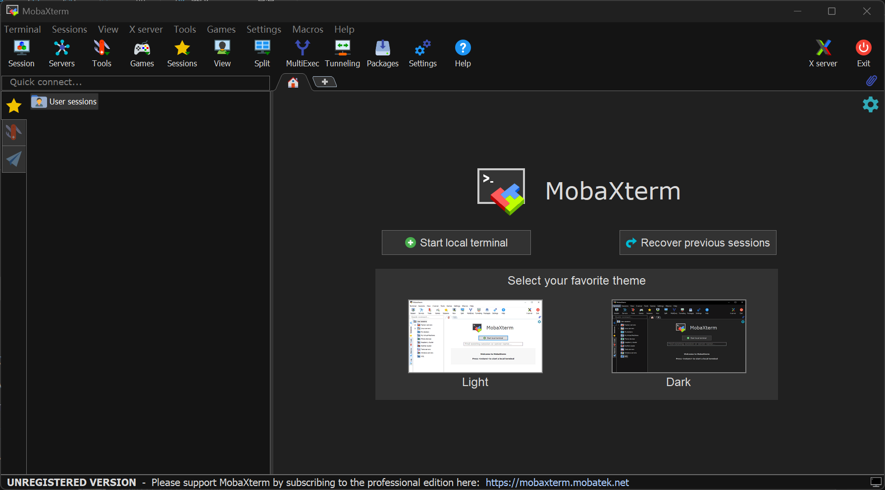

### 1.3、基础串口设置：选择对应的 COM 端口（如 COM34），设置波特率为 115200。

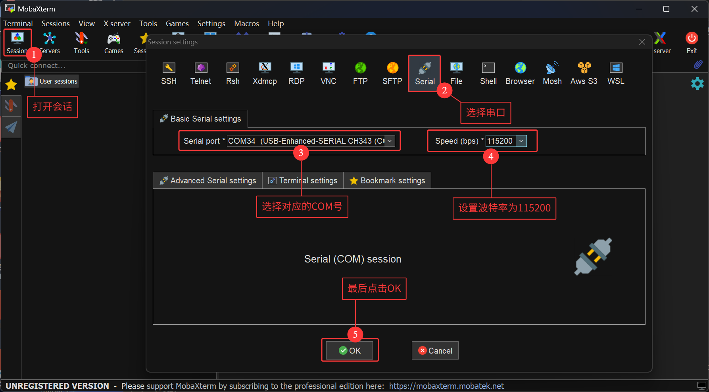

### 1.4、点击 “OK”，即可看到终端输出信息。

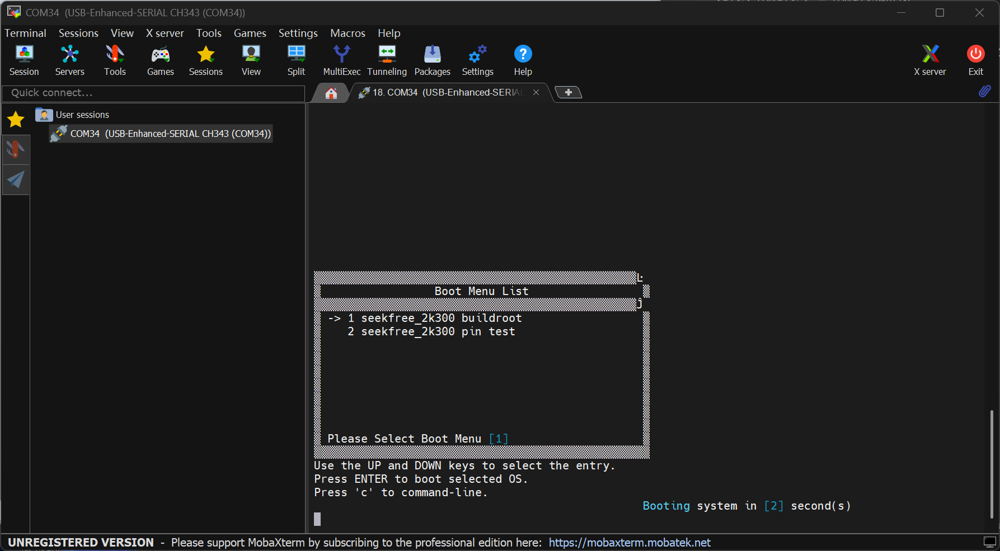

### 1.5、系统启动后，输入小写 “root” 并按回车，完成登录。

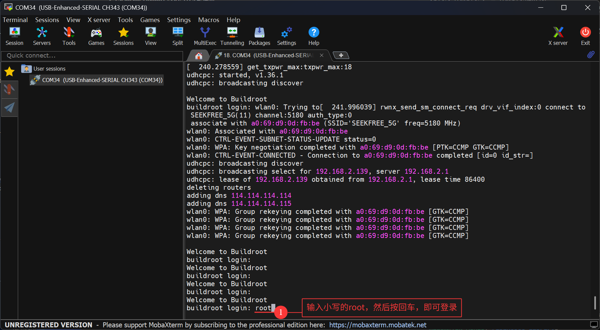

## 2、使用ssh连接

### 2.1、查看LS2K0300核心板IP地址

在 LS2K0300 终端中输入`ifconfig`，获取核心板 IP 地址（确保核心板与 Ubuntu 处于同一局域网）。

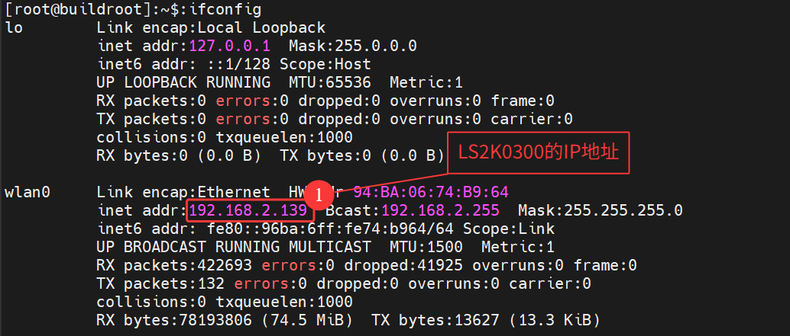

这里，我们可以看到LS2K0300核心板的IP地址为192.168.2.139。

### 2.2、使用SSH进行连接

按照下图进行填写：

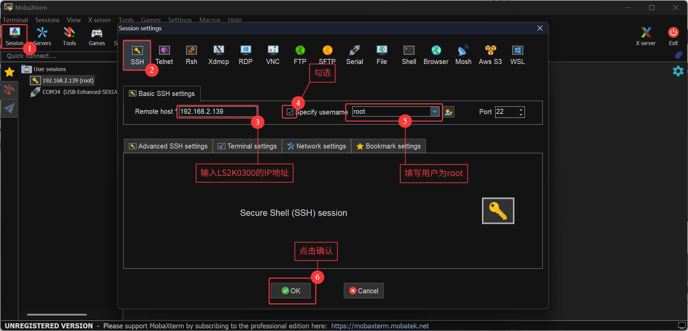

点击OK后，正常情况会出现下面的页面：

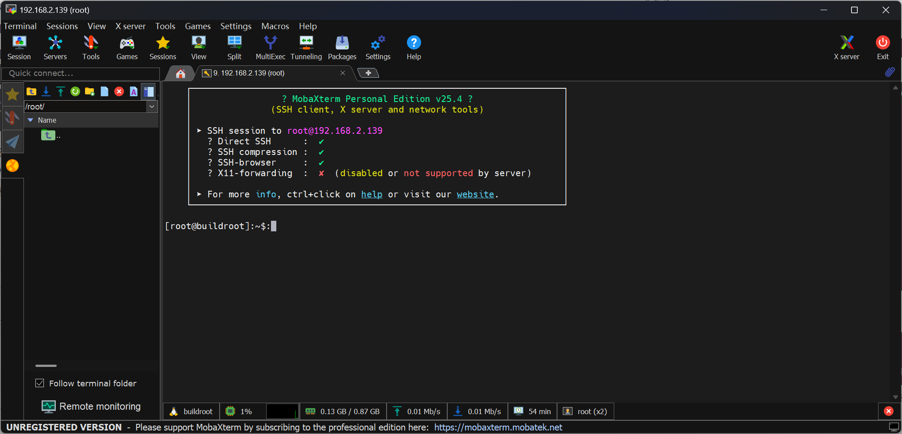

# 六、2K0300核心板连接无线网络

按照 “五、连接 LS2K0300 核心板终端” 章节完成终端连接。

## 1、开机自动连接网络

在串口终端中输入以下命令，编辑无线网络配置文件：

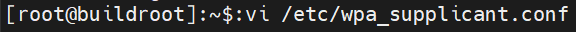

```
vi /etc/wpa_supplicant.conf
```

可以看到这里面有如下：

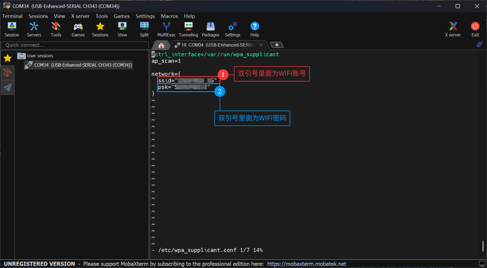

配置文件中，将 “ssid” 字段修改为实际 WiFi 账号，“psk” 字段修改为实际 WiFi 密码。

输入`reboot`命令重启核心板，完成网络连接。

# 七、使用ssh传输文件

## 1、安装 SSH 相关工具

在 Ubuntu 中执行以下命令：

```
sudo apt-get install openssh-client openssh-server
sudo apt-get install net-tools
```

输入ssh

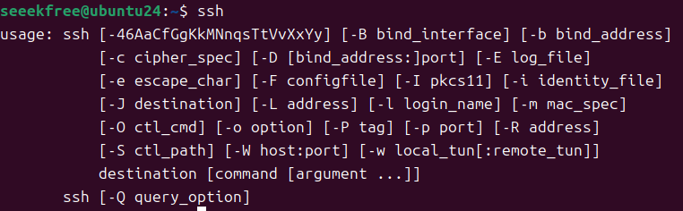

## 2、传输文件操作

在 Ubuntu 中，使用 vi 命令新建测试文件（示例）：

```
vi SEEKFREE_APP
```


随便输入个内容，我这里输入125

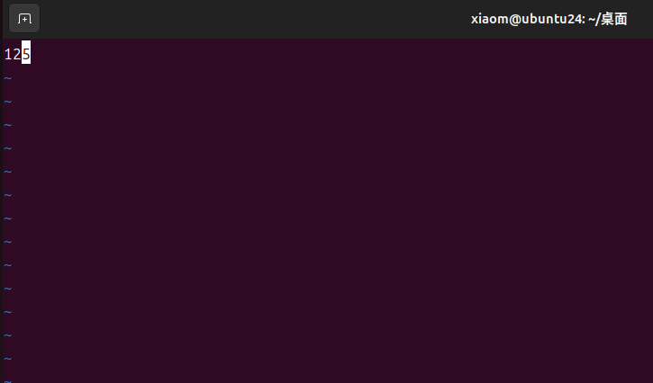

然后保存退出。

输入任意内容后保存退出，执行`ls -l`可查看文件是否创建成功。

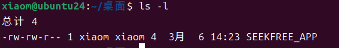

在 LS2K0300 终端中输入`ifconfig`，获取核心板 IP 地址（确保核心板与 Ubuntu 处于同一局域网）。


在 Ubuntu 终端中执行以下命令传输文件（将 IP 地址替换为实际核心板 IP）：

在ls2k0300终端中，输入ifconfig，查看一下本机IP地址：


将SEEKFREE_APP文件传输至2K0300的/home/root路径下。这里的IP地址需要跟LS2K0300一致。

```
scp -O SEEKFREE_APP root@192.168.2.139:/home/root/
```

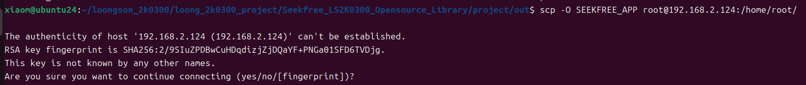

首次传输需输入 “yes” 进行认证，后续无需重复认证。

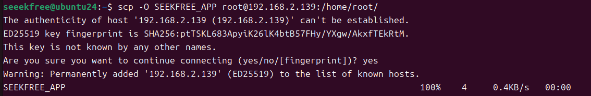

这里我们就将ubuntu中的SEEKFREE_APP传输到了2K0300的/home/root目录下了

在 LS2K0300 终端中执行`ls -l`可查看文件是否传输成功，执行`cat SEEKFREE_APP`可查看文件内容。

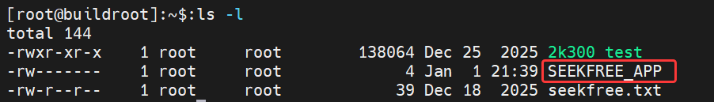

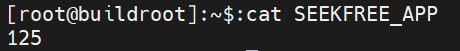

# 八、安装教程交叉编译器和OpenCV库

## 1、前期准备

安装 open-vm-tools 以支持 Windows 与 Ubuntu 之间的文件复制粘贴：

```
sudo apt-get install open-vm-tools -y
sudo apt-get install open-vm-tools-desktop -y
```

拉取开源库

```
git clone https://gitee.com/seekfree/LS2K0300_Library.git
```

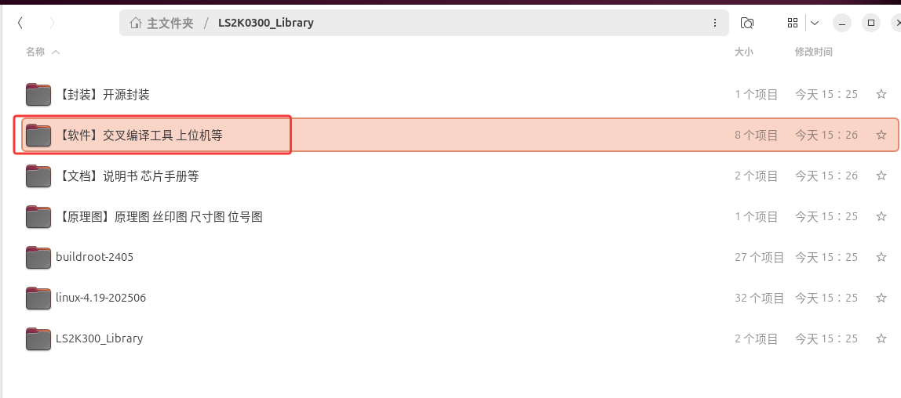

后面需要使用的opencv_4_10_build.tar.xz和loongson-gnu-toolchain-8.3-x86_64-loongarch64-linux-gnu-rc1.6.tar.xz都在<【软件】交叉编译工具 上位机等>这个文件夹里面

## 2、UBUNTU安装2k0300交叉编译器和OpenCV库

进入<【软件】交叉编译工具 上位机等>这个文件夹中，运行终端

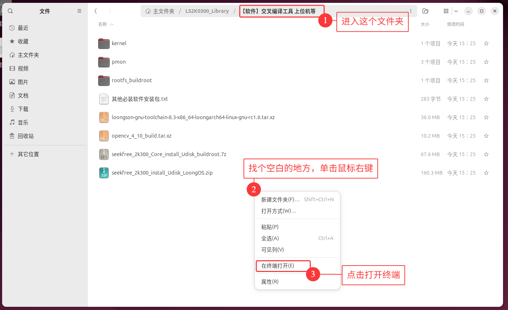

新建一个文件夹存放交叉编译工具链和opencv库，终端里面输入:

```
sudo mkdir -p /opt/ls_2k0300_env
输入ubuntu密码
```

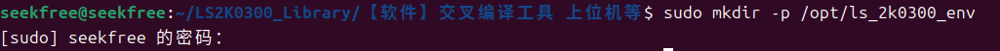

解压opencv_4_10_build和loongson-gnu-toolchain-8.3-x86_64-loongarch64-linux-gnu-rc1.6到/opt/ls_2k0300_env文件夹中，终端里面输入：

```
sudo tar -xvf opencv_4_10_build.tar.xz -C /opt/ls_2k0300_env
sudo tar -xvf loongson-gnu-toolchain-8.3-x86_64-loongarch64-linux-gnu-rc1.6.tar.xz -C /opt/ls_2k0300_env
```

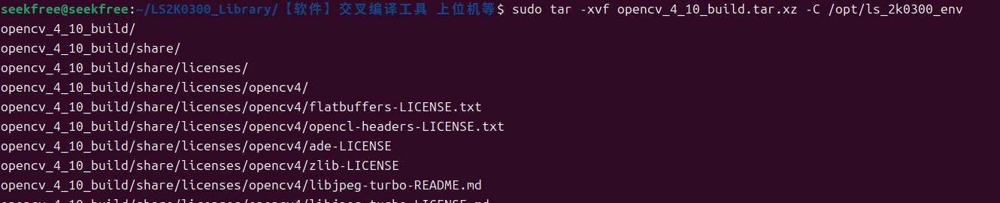

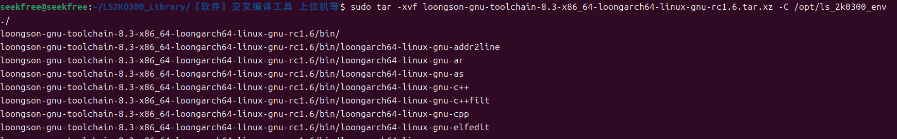

这个时候，我们进入/opt/ls_2k0300_env路径中，即可看到，这两个文件夹。


## 3、2K0300安装OpenCV库

编译 buildroot 时已集成 opencv4.10 库，无需再次安装。

编译 buildroot 时已集成 opencv4.10 库，无需再次安装。

编译 buildroot 时已集成 opencv4.10 库，无需再次安装。

# 九、编译开源库

## 1、拉取开源库

在前面，我们已经过拉取开源库了。

```
git clone https://gitee.com/seekfree/LS2K0300_Library.git
```

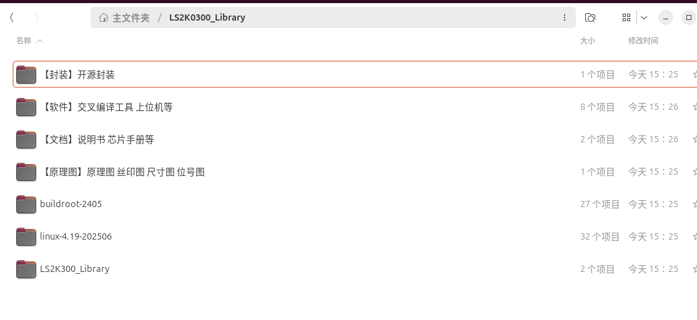

## 2、编译开源库

打开LS2K300_Library/Seekfree_LS2K0300_Opensource_Library/project/user目录


可以看到里面有四个文件:

- build.sh是编译脚本，直接运行这个就可以编译应用程序。
- CMakeLists.txt 是使用 CMake 构建系统时的核心配置文件，用于描述项目的构建规则，CMake 会依据其中信息生成对应平台的构建文件，像 Makefile、Visual Studio 解决方案等 ，进而完成项目的编译和构建
- cross.cmake 通常是一个用于交叉编译的 CMake 工具链文件。
- main.cpp是用户编写程序的地方。

在这里打开终端，然后运行下面的指令：

直接运行./build.sh即可生成APP

```
./build.sh
```

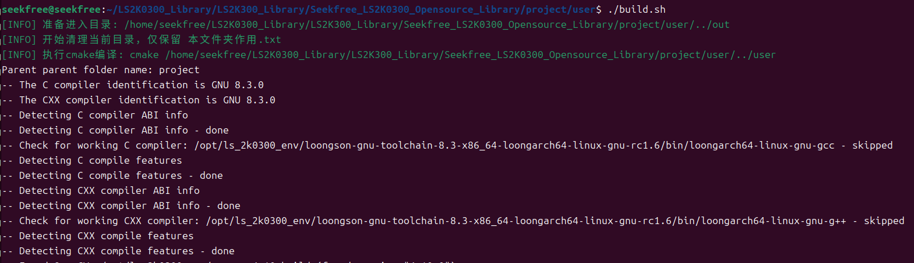

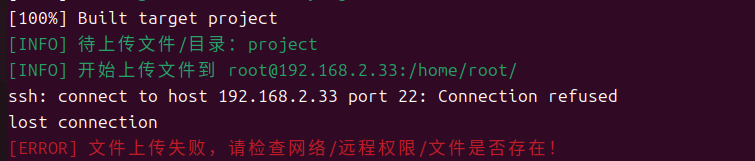

若提示上传失败，在 LS2K0300 终端中输入`ifconfig`获取 IP 地址，再次执行`./build.sh`即可。


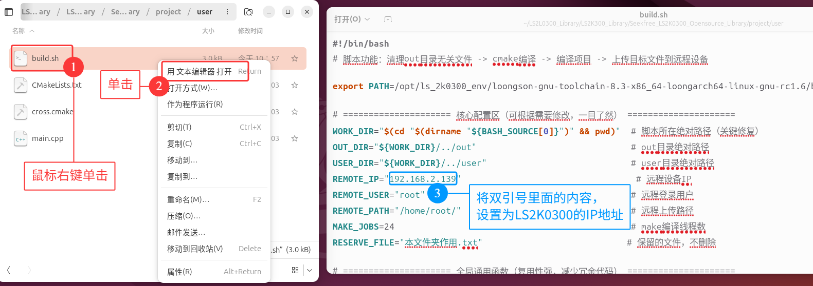

再次输入./build.sh，即可看到文件上传成功。

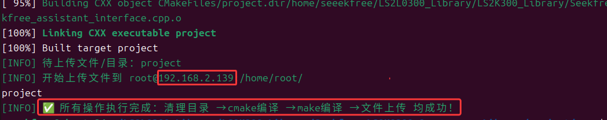

这个时候，我们打开ls2k0300的终端，输入ls -l，既可看到project这个应用程序。

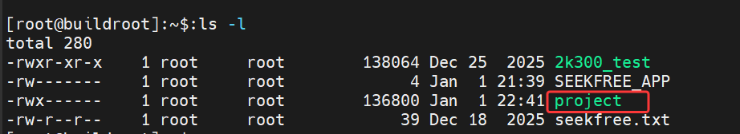

# 十、编译内核

**内核源码适用于需要修改引脚或驱动的用户，无需修改设备树或驱动时，可直接使用预编译内核。**

安装必要依赖包（若已安装可跳过）：

```
sudo apt-get install open-vm-tools -y
sudo apt-get install open-vm-tools-desktop -y
sudo apt-get install git -y
sudo apt-get install cmake -y
sudo apt-get install bison -y
sudo apt-get install flex -y
sudo apt-get install libssl-dev -y
sudo apt-get install openssh-client -y
sudo apt-get install openssh-server -y
sudo apt-get install net-tools -y
sudo apt-get install libncurses5-dev -y
sudo apt-get install ncurses-dev libncurses5-dev libncursesw5-dev build-essential -y
sudo apt-get install gedit -y
```

## 1、拉取开源库

在前面，我们已经过拉取开源库了。

```
git clone https://gitee.com/seekfree/LS2K0300_Library.git
```


其中linux-4.19-202506目录为linux 4.19版本的内核。

进入这个目录，然后运行终端。

## 2、尝试编译内核

进入内核目录，在根目录下，运行./build.sh就会自动导出交叉编译工具链，以及编译。

```
./build.sh
```

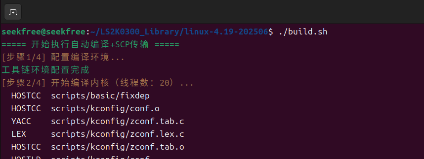

编译完成后就会出现vmlinuz这个文件，这个文件就是内核文件。

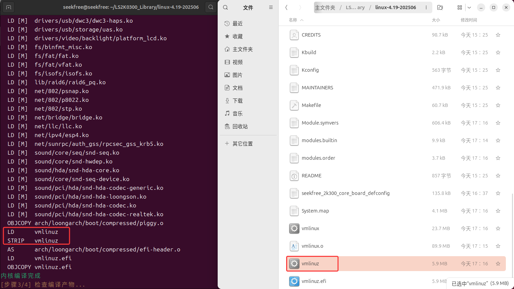

到了这里，内核已经编译完成。

后面这里，提示ssh无法连接，原因是SSH的地址不对，需要修改为LS2K0300核心板的IP地址。

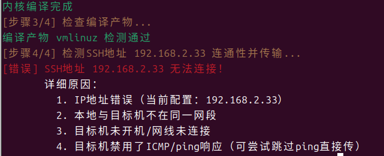

此时我们需要，在LS2K0300核心板终端中，输入ifconfig，查看一下本机IP地址：


然后，修改编译脚本的IP地址，与LS2K0300核心板一致。

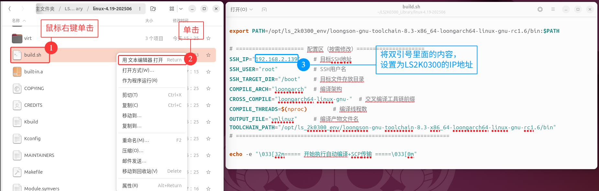

最后，再次运行./build.sh即可

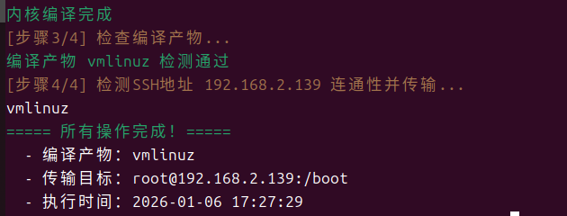

**等待复制完成，一定要输入sync同步一下，再输入reboot。**

**等待复制完成，一定要输入sync同步一下，再输入reboot。**

**等待复制完成，一定要输入sync同步一下，再输入reboot。**

**重要的事情，说三次！！！**


否则就可能出现，内核没有复制完成，重启后无法加载内核，启动失败的情况。

## 3、更新内核

LS2K0300的内核文件存放在，/boot目录下。

### 3.1、使用ssh传输

内核的更新可以使用ssh中的scp -O命令，把文件传输到对应的目录下即可。

```
scp -O vmlinuz root@192.168.2.139:/boot
```

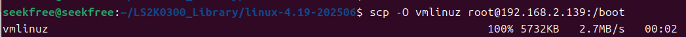

**等待复制完成，一定要输入sync同步一下，再输入reboot。**

**等待复制完成，一定要输入sync同步一下，再输入reboot。**

**等待复制完成，一定要输入sync同步一下，再输入reboot。**

**重要的事情，说三次！！！**


否则就可能出现，内核没有复制完成，重启后无法加载内核，启动失败的情况。

### 3.2、使用mobaxterm终端工具传输

或者可以使用mobaxterm工具，直接将vmlinuz拖入该目录(\boot)下。

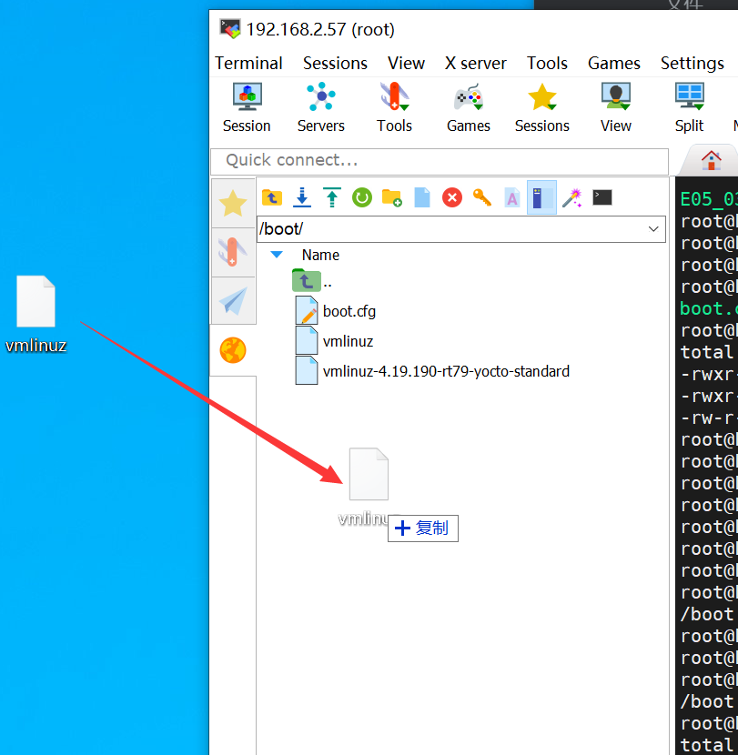

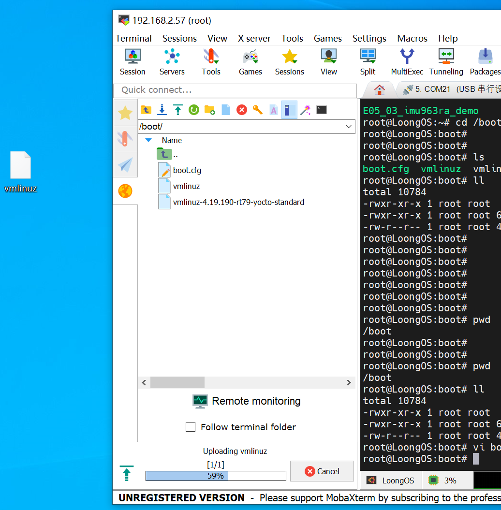

**等待复制完成，一定要输入sync同步一下，再输入reboot。**

**等待复制完成，一定要输入sync同步一下，再输入reboot。**

**等待复制完成，一定要输入sync同步一下，再输入reboot。**

**重要的事情，说三次！！！**


否则就可能出现，内核没有复制完成，重启后无法加载内核，启动失败的情况。

# 十一、编译根文件系统

做智能车的同学，不需要编译buildroot。这里是为了方便其他有需要的客户提供的。使用./build.sh，即可编译。

做智能车的同学，不需要编译buildroot。这里是为了方便其他有需要的客户提供的。使用./build.sh，即可编译。

做智能车的同学，不需要编译buildroot。这里是为了方便其他有需要的客户提供的。使用./build.sh，即可编译。

# 十二、安装vscode，使用ssh连接ubuntu

**本章节主要讲解的是，在windows里面安装vscode。然后使用windows的vscode通过ssh连接ubuntu，并打开ubuntu中的文件夹。**

## 1、windows安装vscode，使用ssh连接ubuntu

下载链接：https://code.visualstudio.com/Download


安装，就是一直点下一步，就可以完成安装。

## 2、windows使用ssh连接ubuntu

ubuntu需要提前安装

```
sudo apt-get install openssh-client openssh-server
```

### 2.1、vscode安装中文


### 2.2、vscode安装Remote-SSH

打开vscode安装Remote-SSH

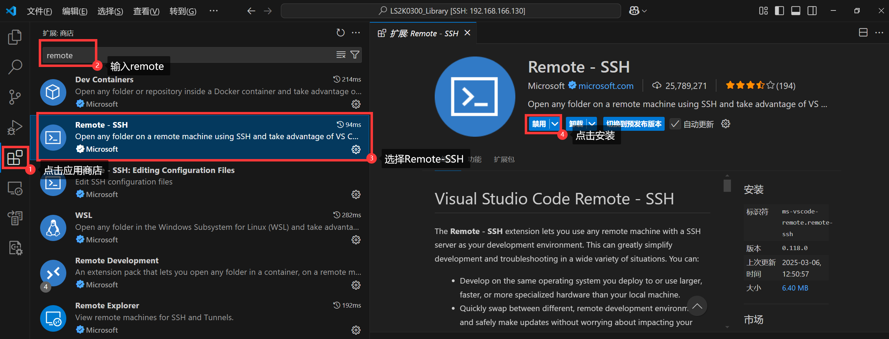

### 2.3、vscode使用ssh连接ubuntu

查看ubuntu的ip地址，使用ifconfig指令。

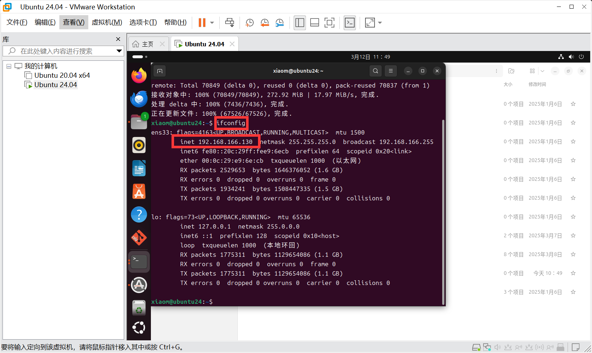

如果没有ifconfig命令，就需要安装：

```
sudo apt-get install net-tools
```

我这个ubuntu的用户名为：xiaom。ip地址为：192.168.166.130

我就应该输入 

```
ssh xiaom@192.168.166.130
```

如果是其他用户名和ip地址，按照 ssh user@ip 输入即可。

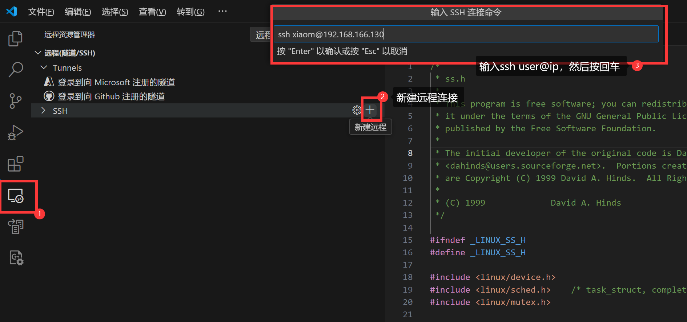

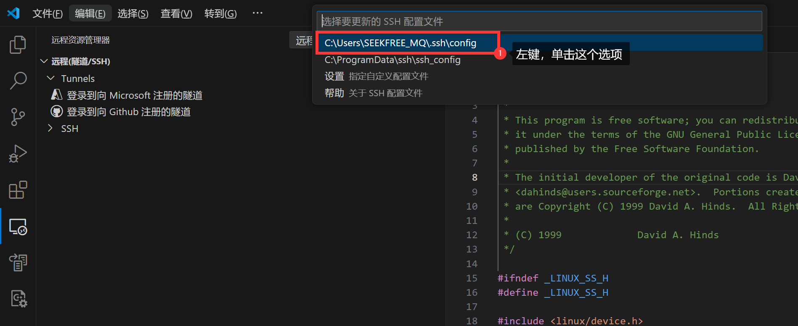

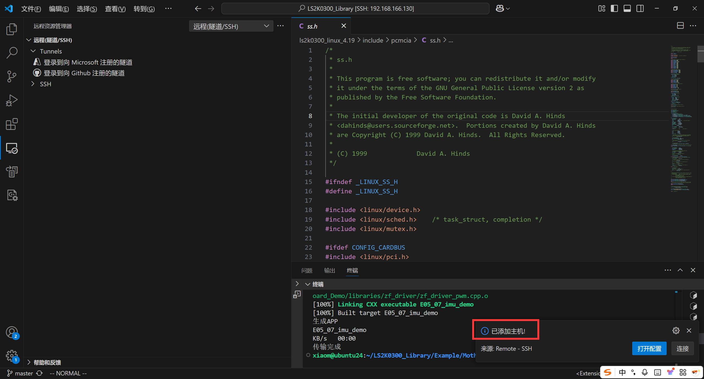

这里提示已添加主机，则添加成功。

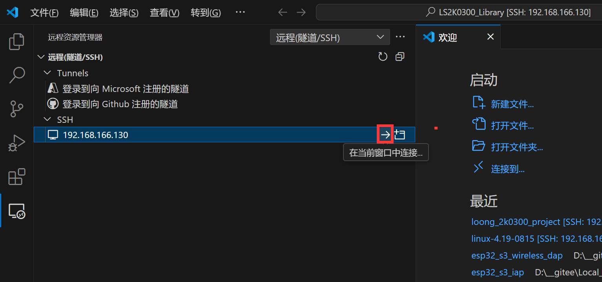

## 3、windows使用vscode打开开源库


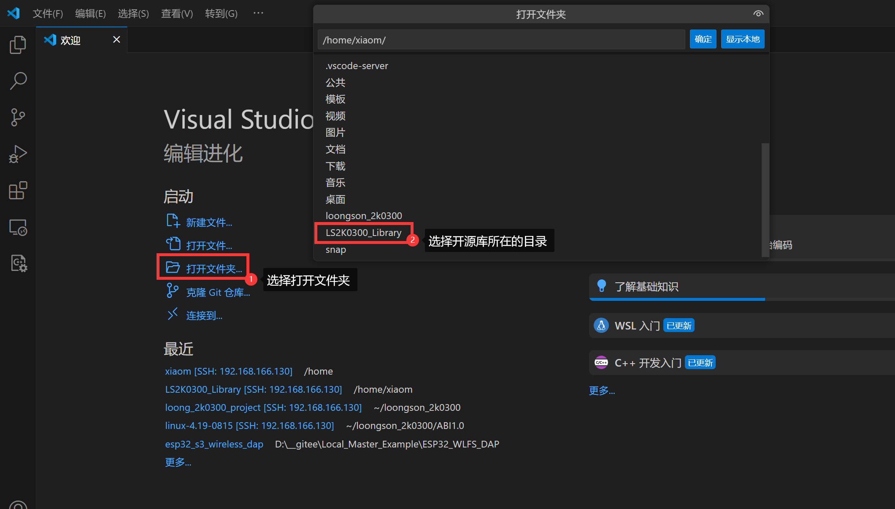

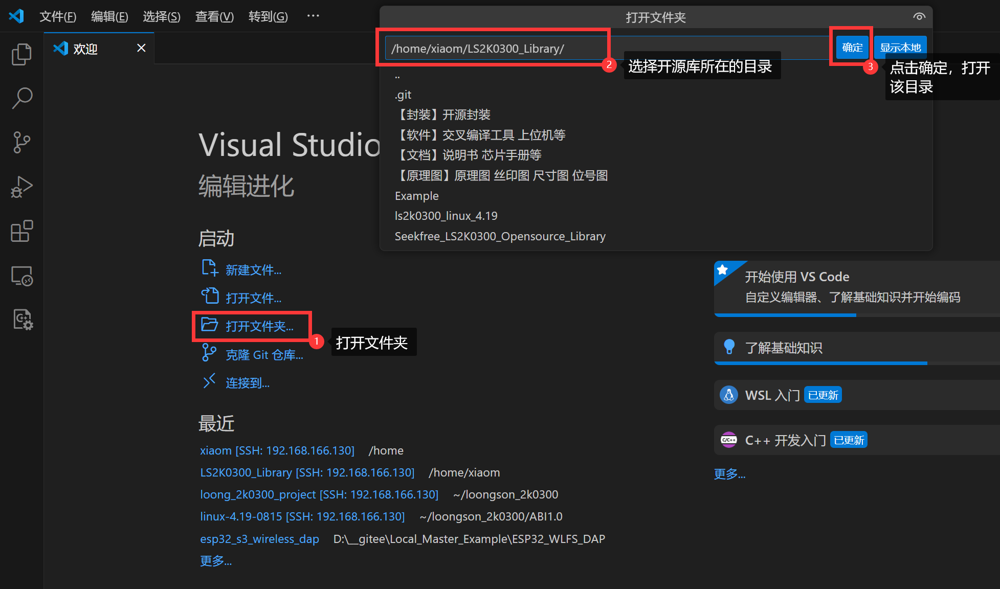

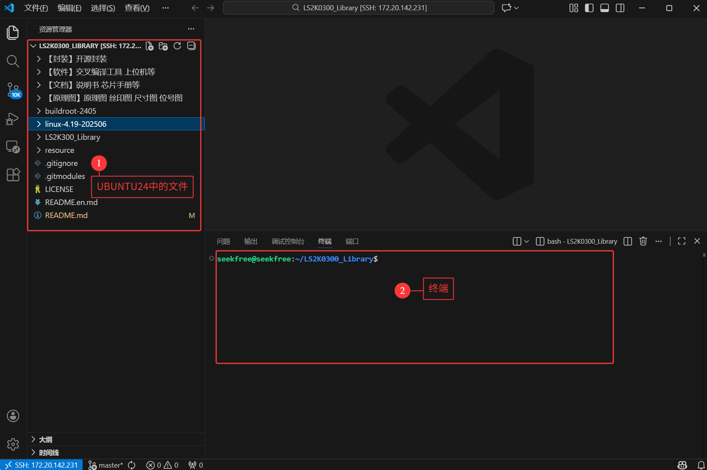

## 4、windows使用vscode编译开源库和内核

```
必要的软件，需要提前安装好。
sudo apt-get install open-vm-tools
sudo apt-get install open-vm-tools-desktop
sudo apt-get install git
sudo apt-get install cmake
sudo apt-get install bison
sudo apt-get install flex
sudo apt-get install libssl-dev
sudo apt-get install libncurses5-dev
```

### 4.1、编译开源库

打开user目录，然后运行编译脚本即可编译开源库。

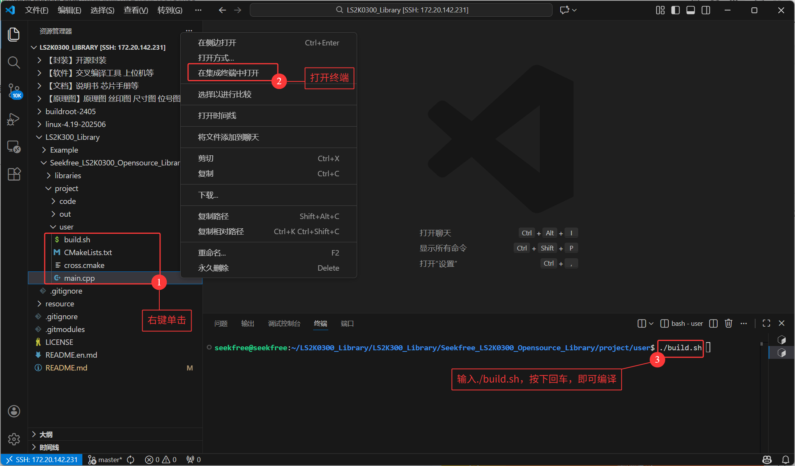

也可以使用下面命令进行编译。

```
export PATH=/opt/ls_2k0300_env/loongson-gnu-toolchain-8.3-x86_64-loongarch64-linux-gnu-rc1.6/bin:$PATH
cmake .
make -j12
```

### 4.2、编译内核

打开内核文件夹根目录，然后运行编译脚本即可编译开源库。

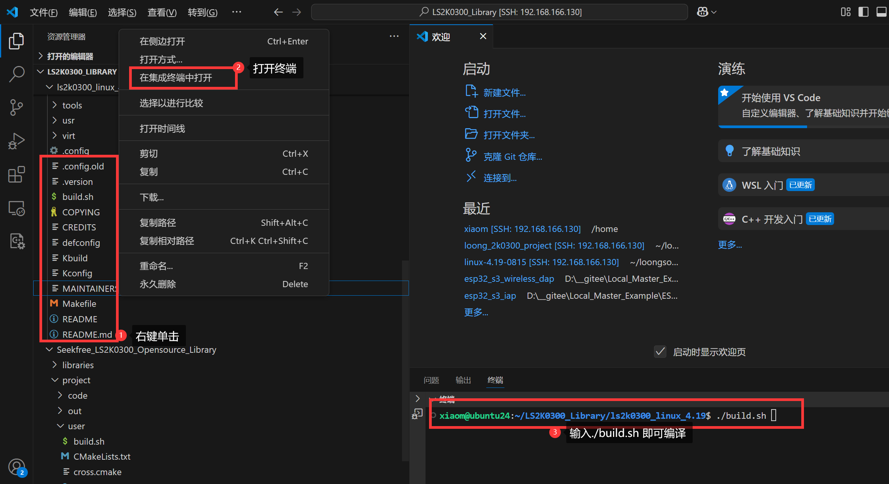

也可以使用命令编译内核

```
export PATH=/opt/ls_2k0300_env/loongson-gnu-toolchain-8.3-x86_64-loongarch64-linux-gnu-rc1.6/bin:$PATH
make -j$(nproc)
```

# 十三、设备树讲解

linux引入设备树的目的是用统一、灵活且便于维护的方式来描述硬件设备信息，让内核能够更好地适配不同的硬件平台和配置变动。如此一来，诸如引脚定义、引脚复用以及引脚配置等功能都能在设备树里统一设置。要是需要对引脚进行修改，仅调整设备树就可以了。

当前，我们所添加的驱动是直接编译到内核里的。在 IMU、屏幕等设备启动时，会对它们进行初始化。但如果在设备启动后再插入，这些设备就无法被初始化，此时就必须重启久久派板卡。

之前我们考虑过将驱动编译成模块进行加载，不过后来觉得这样会多几个不必要的操作，所以就直接把驱动编译进内核了。这样，加载内核后，我们编写的驱动也就随之加载好了。

## 1、配置编译哪一个设备树

### 1.1、打开配置文件

.config为配置文件，这个文件里面提供的编译选项。

我们找到CONFIG_DUILTIN_DTB_NAME选项，可以看到，我们编译的设备树名称为：seekfree_2k0300_coreboard

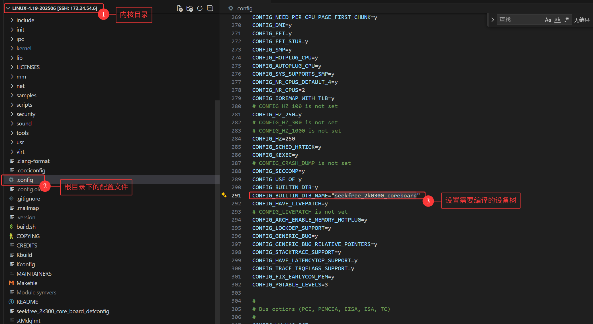

### 1.2、使用图形化界面打开配置文件

在编译之前，需要先导出交叉编译工具链

```
export PATH=/opt/ls_2k0300_env/loongson-gnu-toolchain-8.3-x86_64-loongarch64-linux-gnu-rc1.6/bin:$PATH
```

然后输入：

```
make menuconfig
```

即可进入图形化配置界面。

->kernel type
	->Enable builtin dtb in kernel 
		->(seekfree_2k0300_coreboard) Built in DTB 

按照这个路径查找，可以看到，我们的设备树名称为：seekfree_2k0300_coreboard

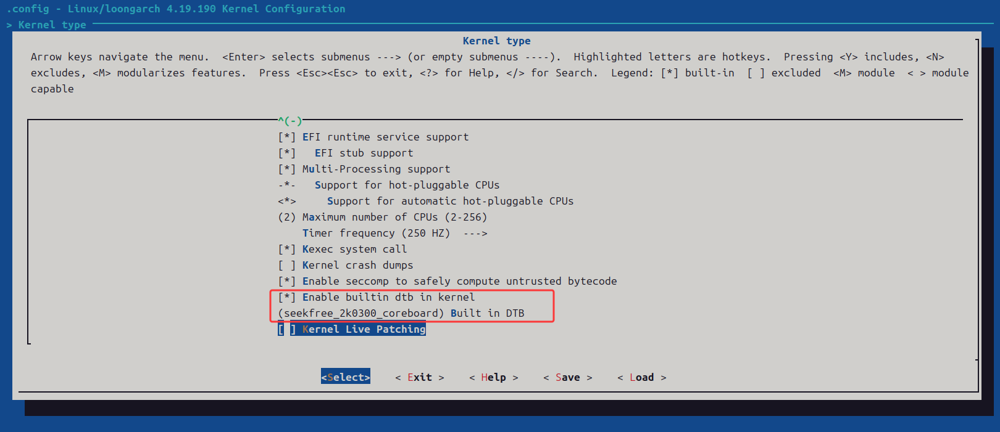

逐飞科技2k0300核心板的设备树，存放在/arch/loongarch/boot/dts/loongson这个路径下：

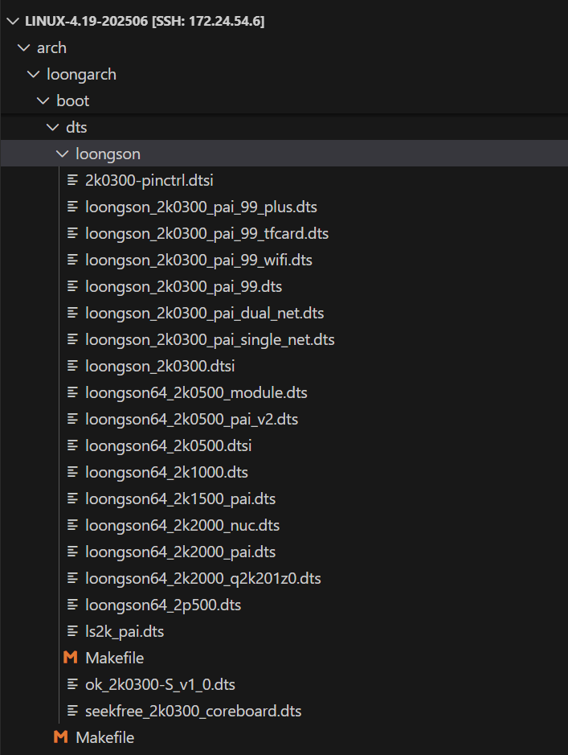

这里，我们需要关注三个文件

2k0300-pinctrl.dtsi为引脚复用信息，这个文件一般是不允许修改的。

loongson_2k0300.dtsi这个文件为设备树的基础配置文件，可以打开看到，里面的status值都是 "disabled"。这个文件一般也是不允许被修改的。

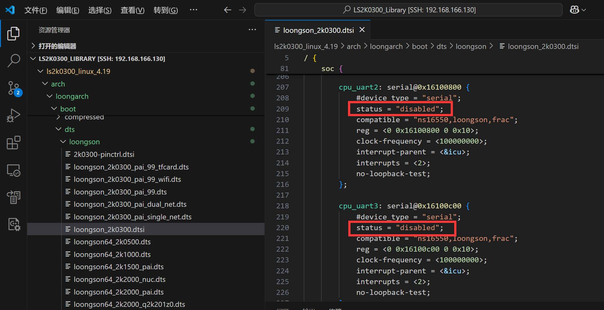

还有一个文件为seekfree_2k0300_coreboard.dts，这个文件允许用户自行配置引脚，复用等功能。

## 2、打开seekfree_smart_car_pai_99.dts

设备树与驱动的匹配是通过compatible属性进行匹配。接下来，我们简单讲解下设备树。

我们以蜂鸣器属性为例：

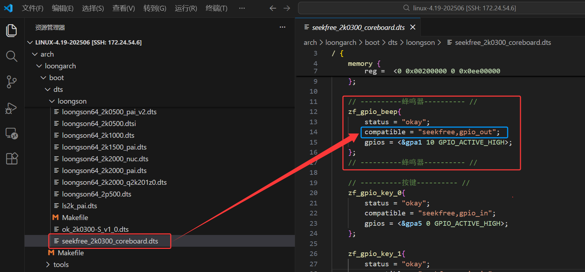

compatible 属性为： "seekfree,gpio_out"

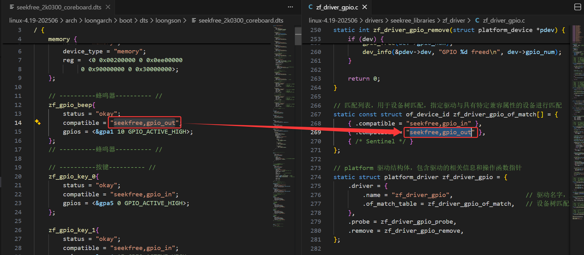

设备树中和驱动中，有相同的compatible属性，就代表这个设备树，使用该驱动文件。

### 2.1、compatible = "seekfree,gpio_out"

蜂鸣器和8701E驱动的方向引脚，需要设置为输出。

```
zf_gpio_beep{
    status = "okay";
    compatible = "seekfree,gpio_out";
    gpios = <&gpa1 10 GPIO_ACTIVE_HIGH>;
};
```

我们以蜂鸣器为例：

1. `zf_gpio_beep`为设备的名称，会在久久派板卡中生成`/dev/zf_gpio_beep`这个文件，我们只需要写这个文件，就能实现蜂鸣器的控制。
2. `status`表示设置设备的状态。`"okay"` 表示该设备处于可用状态，当 Linux 内核解析设备树时，会识别到这个设备并尝试对其进行初始化和配置。如果状态设置为 `"disabled"`，则内核会忽略该设备。
3. `compatible`的属性为匹配字符串，只有设备树与驱动匹配才会自动进行加载。
4. `gpios`为引脚，`gpa1`代表第1组，每一组引脚有16个，引脚号为10，也就是GPIO26引脚，引脚的计算公式为：`1*16 + 10 = 26`

### 2.2、compatible = "seekfree,gpio_in"

按键和拨码开关等引脚，需要设置为输入。

```
zf_gpio_key_0{
status = "okay";
compatible = "seekfree,gpio_in";
gpios = <&gpa5 0 GPIO_ACTIVE_HIGH>;
};
```

以`zf_gpio_key_0`为例：

1. `zf_gpio_key_0`为设备的名称，会在久久派板卡中生成/dev/zf_gpio_key_0这个文件，我们只需要读这个文件，就能可以获取引脚状态。
2. `status`表示设置设备的状态。`"okay"` 表示该设备处于可用状态，当 Linux 内核解析设备树时，会识别到这个设备并尝试对其进行初始化和配置。如果状态设置为 `"disabled"`，则内核会忽略该设备。
3. `compatible`的属性为匹配字符串，只有设备树与驱动匹配才会自动进行加载。
4. `gpios`为引脚，`gpa5`代表第5组，每一组引脚有16个，引脚号为0，也就是GPIO80引脚，引脚的计算公式为：`5*16 + 0 = 80`

### 2.3、compatible = "seekfree,imu"

使用SPI驱动的IMU660RA、IMU660RB、IMU963RA。这个驱动会自动判断是什么设备，然后自动生成IIO设备。

可以在`/sys/bus/iio/devices/iio:device1/`目录下看到，六轴或者九轴的设备文件。

这段设备树代码描述了一个基于 硬件 SPI 总线控制器 `spi1`，并在该总线上挂载了一个 IMU 设备 `imu`。通过这些信息，Linux 内核可以识别和配置这两个设备，实现相应的通信和控制功能。

```
&spi1 {
    status = "okay";
    pinctrl-names = "default";
    pinctrl-0 = <&spi1_4bit>;
    imu: imu@0 {
        status = "okay";
        gpio-controller;
        compatible = "seekfree,imu";    // 自动识别IMU660RA IMU660RB IMU963RA
        spi-max-frequency = <10000000>;
        reg = <0>;
    };
};
```

1. spi1节点

```dts
status = "okay";
pinctrl-names = "default";
pinctrl-0 = <&spi1_4bit>;
```

- `status`表示设置设备的状态。`"okay"` 表示该设备处于可用状态，当 Linux 内核解析设备树时，会识别到这个设备并尝试对其进行初始化和配置。如果状态设置为 `"disabled"`，则内核会忽略该设备。
- `pinctrl-names` 属性定义了一组引脚控制状态的名称。这里设置为 `"default"`，意味着该设备使用名为 `"default"` 的引脚控制配置。引脚控制配置通常用于指定设备所使用的 GPIO 引脚的复用功能、电气特性等。
- `pinctrl-0 = <&spi1_4bit>`：表明使用硬件SPI1引脚，其相关引脚可以通过查阅`loongson_2k0300.dtsi`得到。

```dts
spi1_4bit: spi1-4bit{
        loongson,pinmux = <&gpa3 12 15>;
        loongson,pinmux-funcsel = <PINCTL_FUNCTIONMAIN>;
    };
```

- `loongson,pinmux = <&gpa3 12 15>`表示使用GPIO60到GPIO63，这四个引脚。
- ` loongson,pinmux-funcsel = <PINCTL_FUNCTIONMAIN>`表示使用把这几个引脚初始化为PINCTL_FUNCTIONMAIN功能。

2. imu子节点

```dts
imu: imu@0 {
	status = "okay";
	compatible = "seekfree,imu";  // 自动识别IMU660RA IMU660RB IMU963RA
	spi-max-frequency = <10000000>;
	reg = <0>;
};
```

- `imu: imu@0`：`imu` 是该节点的标签，方便在其他地方引用；`imu@0` 表示该设备在 SPI 总线上的片选编号为 0。
- `status = "okay"`：表示该 IMU 设备处于可用状态。
- `compatible = "seekfree,imu"`：表示该设备与 `seekfree,imu` 兼容，注释中提到可以自动识别 IMU660RA、IMU660RB 和 IMU963RA 等型号。
- `spi-max-frequency = <10000000>`：指定该 IMU 设备在 SPI 总线上支持的最大通信频率为 10MHz。
- `reg = <0>`：表示该设备在 SPI 总线上的片选编号为 0，与节点名称中的 `@0` 对应。

### 2.4、compatible = "sitronix,st7789v"

这个节点为IPS200屏幕，目前只支持IPS200屏幕。

即使同样驱动的IPS114，因分辨率和坐标偏移是不一样的。所以目前不支持。

```
&spi3{
    status = "okay";
    pinctrl-names = "default";
    pinctrl-0 = <&spi3_pin>;

    st7789v:st7789v@0{
        status = "okay";
        compatible = "sitronix,st7789v";
        reg = <0>;              //chip select 0:cs0  1:cs1
        spi-max-frequency =<50000000>;
        spi-mode = <0>;
        rgb;
        rotate = <0>;           // 旋转方向 0 90 180 270
        buswidth = <8>;
        fps = <30>;             // 帧率
        reset-gpios = <&gpa5 1 GPIO_ACTIVE_HIGH>;   // GPIO81
        dc-gpios = <&gpa4 10 GPIO_ACTIVE_HIGH>;     // GPIO74
        led-gpios = <&gpa4 11 GPIO_ACTIVE_LOW>;     // 背光引脚 GPIO75
        width = <240>;     
        height= <320>;      
        debug = <0x0>;
    };
};
```

这个节点是使用的硬件SPI驱动的屏幕。

节点内容按照格式填写即可。

### 2.5、compatible = "seekfree,dl1x"

这段设备树代码的核心是：**通过 GPIO 模拟实现 I2C4 总线（软件 I2C），并在该总线上挂载逐飞科技 DL1x（DL1A/DL1B）TOF测距模块**，是嵌入式系统中 “描述硬件拓扑 + 配置硬件参数” 的标准写法，内核会根据这些配置初始化对应的硬件驱动。

使用软件IIC驱动的DL1A、DL1B。这个驱动会自动判断是什么设备，然后自动生成IIO设备。

```
i2c4{
	compatible = "i2c-gpio";
    status = "okay";    
    gpios = <&gpa3 1 GPIO_ACTIVE_HIGH>, // SDA GPIO49 
    <&gpa3 0 GPIO_ACTIVE_HIGH>; // SCL GPIO48
    i2c-gpio,delay-us = <1>;	/* 160 kHz */
    i2c-gpio,scl-output-only;

    #address-cells = <1>;
    #size-cells = <0>;

	dl1x:dl1x@0{
        status = "okay"; 
        compatible = "seekfree,dl1x";    // 自动识别DL1A DL1B
        xs-gpios = <&gpa2 6 GPIO_ACTIVE_LOW>; 
        reg = <0x29>;
    };
};
```

​	1.i2c节点

- `compatible = "i2c-gpio"`：区别于硬件 I2C（如`compatible = "loongson,ls2k-i2c"`），软件 I2C 通过 CPU 模拟 I2C 时序，优点是 GPIO 引脚灵活，缺点是速率和效率略低于硬件 I2C；
- `delay-us = <1>`：注释标注 160KHz 是实际调试后的稳定速率（不同硬件走线需调整延时）；
- `scl-output-only`：适用于 “主机模式”（本场景是 CPU 作为 I2C 主机，DL1x 作为从机），无需监听 SCL 引脚的从机反馈，减少 CPU 开销。

​	2.子节点：TOF设备

```
dl1x:dl1x@0{
    status = "okay";  				// 启用DL1x设备（禁用则摄像头驱动不会加载）
    compatible = "seekfree,dl1x";    // 关键：匹配逐飞科技DL1x摄像头的驱动（内核驱动中会通过该字符串识别设备）
    xs-gpios = <&gpa2 6 GPIO_ACTIVE_LOW>;  // DL1x的复位/使能引脚：GPA2组第6号GPIO
    reg = <0x29>;  // DL1x的I2C从机地址：0x29（逐飞DL1A/DL1B默认I2C地址，不可随意修改）
    };

```

- `dl1x:dl1x@0`：`dl1x`是节点别名（方便其他节点引用），`@0`无实际意义（I2C 设备地址由`reg`指定）；
- `compatible = "seekfree,dl1x"`：内核驱动中会定义`OF_MATCH_TABLE`匹配该字符串，匹配成功后加载 DL1x 的摄像头驱动；
- `xs-gpios`：逐飞 DL1x 摄像头的 “硬件复位 / 电源使能” 引脚（不同厂商命名可能不同，如`reset-gpios`），驱动初始化时会通过该引脚复位摄像头；
- `reg = <0x29>`：I2C 从机地址是硬件固定的（DL1x 默认 0x29）。

### 2.6、compatible = "seekfree,encoder_quad"

在逐飞科技LS2K0300核心板上面，使用ATIM和GTIM，分别采集一个编码器。

这里是正交编码器配置，正交编码器和方向编码器只能二选一使用，不能同时使用。

```
&encoder_atim{
    status = "okay";
    compatible = "seekfree,encoder_quad";
    pinctrl-names = "default";
    pinctrl-0 = <&atim_ch1_pin_m0>, <&atim_ch2_pin_m0>;   
    dev-name = "zf_encoder_quad_1";
};

&encoder_gtim{
    status = "okay";
    compatible = "seekfree,encoder_quad";
    pinctrl-names = "default";
    pinctrl-0 = <&gtim_ch1_pin_m0>, <&gtim_ch2_pin_m0>;   
    dev-name = "zf_encoder_quad_2";
};
```

我们以encoder_atim为例：

`status`表示设置设备的状态。`"okay"` 表示该设备处于可用状态，当 Linux 内核解析设备树时，会识别到这个设备并尝试对其进行初始化和配置。如果状态设置为 `"disabled"`，则内核会忽略该设备。

`compatible`的属性为匹配字符串，只有设备树与驱动匹配才会自动进行加载。这行代码设置设备的状态。`"okay"` 表示该设备处于可用状态，当 Linux 内核解析设备树时，会识别到这个设备并尝试对其进行初始化和配置。如果状态设置为 `"disabled"`，则内核会忽略该设备。

`pinctrl-names` 属性定义了一组引脚控制状态的名称。这里设置为 `"default"`，意味着该设备使用名为 `"default"` 的引脚控制配置。引脚控制配置通常用于指定设备所使用的 GPIO 引脚的复用功能、电气特性等。

`pinctrl-0` 属性指定了与 `pinctrl-names` 中第一个名称（这里是 `"default"`）对应的引脚控制配置节点。`<&atim_ch1_pin_m0>` 是一个引用，指向设备树中名为 `pwm0_mux_m0` 的节点，该节点应该定义了该设备使用的引脚的具体配置信息，比如引脚的复用模式、上拉 / 下拉电阻等。同理，`<&gtim_ch2_pin_m0>`也是一个引用。

`dev-name` 属性为设备指定一个名称，这里将设备命名为 `zf_encoder_quad_1`。这个会在久久派板卡中生成`/dev/zf_encoder_quad_1`这个文件，我们只需要读这个文件，就能获取编码器的数据。往这个文件里面写入任意值，就能清空编码器计数

### 2.7、compatible = "seekfree,encoder_dir"

在逐飞科技LS2K0300核心板上面，使用ATIM和GTIM，分别采集一个编码器。

这里是方向编码器配置，正交编码器和方向编码器只能二选一使用，不能同时使用。

```
&encoder_atim{
    status = "okay";
    compatible = "seekfree,encoder_dir";
    pinctrl-names = "default";
    pinctrl-0 = <&atim_ch1_pin_m0>;   
    dir-gpios = <&gpa1 13 GPIO_ACTIVE_LOW>;
    dev-name = "zf_encoder_dir_1";
};
&encoder_gtim{
    status = "okay";
    compatible = "seekfree,encoder_dir";
    pinctrl-names = "default";
    pinctrl-0 = <&gtim_ch1_pin_m0>;
    dir-gpios = <&gpa2 3 GPIO_ACTIVE_LOW>;
    dev-name = "zf_encoder_dir_2";
};
```

我们以encoder_atim为例：

- `status`表示设置设备的状态。`"okay"` 表示该设备处于可用状态，当 Linux 内核解析设备树时，会识别到这个设备并尝试对其进行初始化和配置。如果状态设置为 `"disabled"`，则内核会忽略该设备。
- `compatible`的属性为匹配字符串，只有设备树与驱动匹配才会自动进行加载。
- `pinctrl-names` 属性定义了一组引脚控制状态的名称。这里设置为 `"default"`，意味着该设备使用名为 `"default"` 的引脚控制配置。引脚控制配置通常用于指定设备所使用的 GPIO 引脚的复用功能、电气特性等。
- `pinctrl-0` 属性指定了与 `pinctrl-names` 中第一个名称（这里是 `"default"`）对应的引脚控制配置节点。`<&atim_ch1_pin_m0>` 是一个引用，指向设备树中名为 `pwm0_mux_m0` 的节点，该节点应该定义了该设备使用的引脚的具体配置信息，比如引脚的复用模式、上拉 / 下拉电阻等。同理，`<&gtim_ch1_pin_m0>`也是一个引用。
- `dir-gpios`属性为：编码器方向引脚，`gpa1`代表第1组，每一组引脚有16个，引脚号为13，也就是GPIO29引脚，引脚的计算公式为：`1*16 + 13 = 29`
- `dev-name` 属性为设备指定一个名称，这里将设备命名为 `zf_encoder_dir_1`。这个会在久久派板卡中生成`/dev/zf_encoder_dir_1`这个文件，我们只需要读这个文件，就能获取编码器的数据。往这个文件里面写入任意值，就能清空编码器计数。

### 2.8、compatible = "loongson,ls300-pwm"

```
&pwm0{
    status = "okay";
    pinctrl-names = "default";
    pinctrl-0 = <&pwm0_mux_m1>;
    clock-frequency = <160000000>;
    compatible = "loongson,ls300-pwm";
};
&pwm1{
    status = "okay";
    pinctrl-names = "default";
    pinctrl-0 = <&>;
    clock-frequency = <160000000>;
    compatible = "loongson,ls300-pwm";
};
&pwm2{
    status = "okay";
    pinctrl-names = "default";
    pinctrl-0 = <&pwm2_mux_m1>;
    clock-frequency = <160000000>;
    compatible = "loongson,ls300-pwm";
};
&pwm3{
    status = "okay";
    pinctrl-names = "default";
    pinctrl-0 = <&pwm3_mux_m1>;
    clock-frequency = <160000000>;
    compatible = "loongson,ls300-pwm";
};
```

我们以pwm1为例：

1. `status`表示设置设备的状态。`"okay"` 表示该设备处于可用状态，当 Linux 内核解析设备树时，会识别到这个设备并尝试对其进行初始化和配置。如果状态设置为 `"disabled"`，则内核会忽略该设备。
2. `pinctrl-names` 属性定义了一组引脚控制状态的名称。这里设置为 `"default"`，意味着该设备使用名为 `"default"` 的引脚控制配置。引脚控制配置通常用于指定设备所使用的 GPIO 引脚的复用功能、电气特性等。
3. `pinctrl-0` 属性指定了与 `pinctrl-names` 中第一个名称（这里是 `"default"`）对应的引脚控制配置节点。`<&pwm0_mux_m1>` 是一个引用，指向设备树中名为 `pwm0_mux_m1` 的节点，该节点应该定义了该设备使用的引脚的具体配置信息，比如引脚的复用模式、上拉 / 下拉电阻等。
4. `clock-frequency` 属性设置设备的时钟频率，这里将时钟频率设置为 160000000Hz（即 160MHz）。编码器设备通常需要一个稳定的时钟信号来正常工作，这个时钟频率会影响编码器的采样速度和数据处理能力。
5. `compatible`的属性为匹配字符串，只有设备树与驱动匹配才会自动进行加载。

### 2.9、compatible = "seekfree,pwm"

舵机、电机、电调等设备，都需要设置为pwm。

```
zf_pwm_servo_1{
    compatible = "seekfree,pwm";
    pwms = <&pwm2 0 1000000>;       // pwm3 通道0 周期(用户不需要关心)
    status = "okay";
    freq = <300>;                   // 300HZ 频率
    duty = <0>;                     // 默认 0% 的占空比
    duty_max = <10000>;             // duty最大值，不建议修改。
};
```

这里我们以舵机PWM为例：

`zf_pwm_servo_1`为设备的名称，会在久久派板卡中生成`/dev/zf_pwm_servo_1`这个文件，我们只需要写这个文件，就能可以修改PWM的duty值。

`compatible`的属性为匹配字符串，只有设备树与驱动匹配才会自动进行加载。

`pwms`属性用于指定 PWM 信号的相关信息。
- `&pwm2`：这是一个引用，指向另一个设备树节点 `pwm2`，表示使用这个节点所代表的 PWM 控制器。
- `0`：表示使用 `pwm2` 控制器的第 0 个通道来生成 PWM 信号。仅有 1 个通道可供选择。
- `1000000`：代表 PWM 信号的周期，用户不需要关心这个值。

`status`表示设置设备的状态。`"okay"` 表示该设备处于可用状态，当 Linux 内核解析设备树时，会识别到这个设备并尝试对其进行初始化和配置。如果状态设置为 `"disabled"`，则内核会忽略该设备。

`freq` 属性指定了 PWM 信号的频率，这里设置为 300Hz。舵机通常需要特定频率的 PWM 信号来控制其转动角度。

`duty` 属性表示 PWM 信号初始化的占空比。

`duty_max` 属性定义了占空比的最大值，建议不要修改这个值。

# 十四、开机自动运行代码

## 1、进入启动脚本目录并查看现有脚本

首先通过命令进入系统启动脚本核心目录`/etc/init.d`：

```
vi /etc/init.d
```


进入目录后，执行以下命令查看所有脚本文件及详细信息（重点关注启动脚本的命名和顺序）：

```
ls -l
```


执行后可看到目录内的所有文件，其中前缀为 `Sxxxx` 的是系统自动运行脚本——前缀后的数字（00-99）代表启动优先级，数字越小启动越早（如 00 级脚本用于挂载文件系统等核心操作），数字越大启动越晚（如 99 级脚本用于启动应用程序）。

##  2、调整 IPS200 与 WiFi 脚本的启动顺序（按需操作）

在早期核心板中，IPS200 和 WiFi 对应的启动脚本通常命名为 `S98_ips200` 和 `S99wifi_start`；若查看后发现脚本已为 `S95_ips200` 和 `S96_wifi_start`（更早的启动优先级），则无需执行后续调整命令。

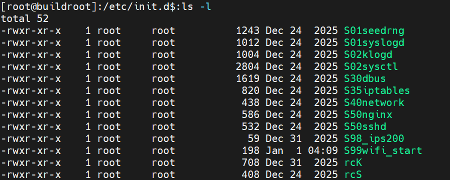

这里，我们就把他们的启动顺序移动到前面。使用命令：

```
mv S98_ips200 S95_ips200
mv S99wifi_start S96_wifi_start
```

修改完成后，再次执行 `ls -l` 验证调整结果：

```
ls -l
```

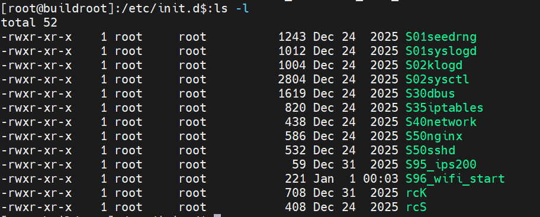

## 3、创建自定义应用自启脚本

执行以下命令新建自定义启动脚本（命名为`S99_my_app`，99 级确保在核心服务启动后运行）：

```
vi S99_my_app
```

进入编辑界面后，添加如下完整脚本内容（以应用程序路径为 `/home/root/project` 为例，需根据你的实际应用路径修改）：

```
#!/bin/sh
# 示例：启动路径为 /home/root/project 的应用程序
# 命令末尾的 & 必须添加，作用是让应用程序在后台运行，避免阻塞系统启动流程（若省略，系统会卡在应用启动界面无法完成启动）
/home/root/project &
```

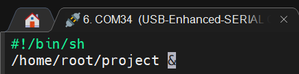

**关键注意点**：命令末尾的 & 必须添加，作用是让应用程序在后台运行，避免阻塞系统启动流程（若省略，系统会卡在应用启动界面无法完成启动）。

然后给脚本添加运行权限

```
chmod +x S99_my_app
```


重启核心板，应用程序将开机自动运行。
